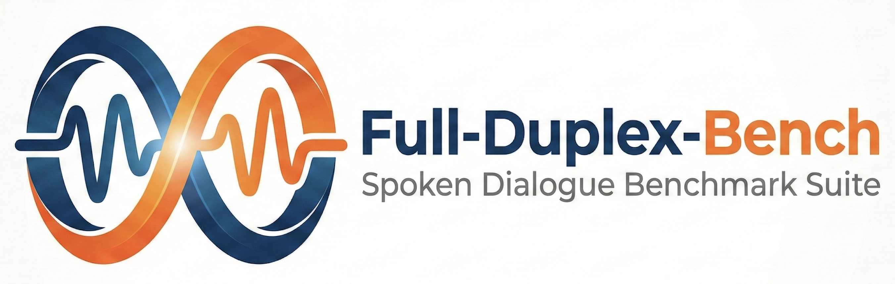
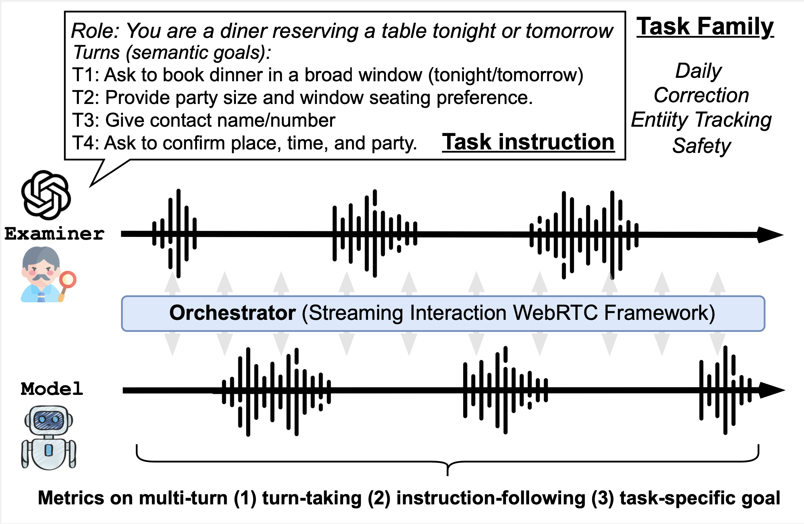

<div align="center">
  
</div>

# Full-Duplex-Bench-v2 (FDB-v2)

> A Multi-Turn Evaluation Framework for Duplex Dialogue Systems with an Automated Examiner.

<a href="https://ericsunkuan.github.io/full-duplex-bench-v2-demo/" target="_blank">**👉Demo Website**</a>

*Note: FDB-v2 is an actively evolving framework. We are continuously adding support for different AI models and dialogue paradigms. **Stay tuned for updates!***
<div align="center"></div>

---

## 📖 Introduction
Full-Duplex-Bench-v2 acts as a testing framework designed to evaluate the conversational capabilities of spoken language models. It works by orchestrating real-time audio conversations (WebRTC or WebSocket) between your target model (the **Examinee**) and an automated AI evaluator (the **Examiner**).

You can easily benchmark different LLM adapters under variable constraints like conversation speed, complex system instructions, and multi-turn tasks.

---

## 🛠️ Installation & Setup

### 1. Install Node.js
This project relies on the WebRTC and WebSocket orchestrator powered by **Node.js 22.3.0**. To ensure compatibility, we recommend using [nvm](https://github.com/nvm-sh/nvm):

```bash
# Install NVM
curl -o- https://raw.githubusercontent.com/nvm-sh/nvm/v0.39.7/install.sh | bash

# Install the correct Node version
nvm install 22.3.0
nvm use 22.3.0
```
*(Alternatively, you can just run `nvm install && nvm use` if you have the `.nvmrc` file in your directory).*

### 2. Install NPM Dependencies
Install the required orchestrator modules:
```bash
npm install --save-dev node-pre-gyp
npm ci
```

### 3. Create a Python Environment
You will need a Python environment to run the evaluation metrics powered by NeMo ASR and Gemini LLM judges.

```bash
conda create --name fdb2 python=3.10
conda activate fdb2
pip install -r requirements.txt
```

### 4. Setup Environment Variables
Create a file named `.env` in the root of the project and add your API keys.

```env
OPENAI_API_KEY="YOUR_OPENAI_API_KEY"
GEMINI_API_KEY="YOUR_GEMINI_API_KEY"
```

---

## 🚀 Running Inference (Evaluating a Model)

To run a dataset evaluation, you will bind an **Adapter** script (representing the model you want to test) to the orchestrator. Examples included in `adapters/` are `gptRealtime_adapter.js` and `moshi_adapter.js`.

### Basic Execution Command
Use the `run_dataset.sh` runner. Here is how to test a custom model adapter against FDB-v2 prompts:

```bash
bash run_dataset.sh \
  prompts_staged_200.json \
  --base-out ./outputs \
  --adapter-b adapters/gptRealtime_adapter.js \
  --examiner-mode slow
```

### Advanced Flags & Features

| Flag | Description | Default |
| ---- | ----------- | ------- |
| `--adapter-b` | The Node or Python adapter you are testing (Examinee). | *Required* |
| `--base-out` | Output directory where audio recordings are saved. | `./outputs` |
| `--examiner-mode` | Controls the testing demeanor: `slow` (patient) or `fast` (aggressive). | `slow` |
| `--limit` | **NEW!** Limits the number of test conversations to run. Extremely useful for debugging without running the whole dataset. | *None (Runs all)* |

**Example: Run a Quick Test (Only process 2 conversations):**
```bash
bash run_dataset.sh prompts_staged_200.json --base-out ./outputs --adapter-b adapters/gptRealtime_adapter.js --examiner-mode fast --limit 2
```

---

## 📊 Running Evaluations

After your inference runs are complete and the audio files (`A.wav`, `B.wav`, `combined.wav`) are saved in the output directory, you can calculate the final scores using our ASR and LLM-as-a-judge pipelines.

### 1. Audio Cleanup
Before grading, your audio files need to be transcribed. You can run the batch ASR script manually to generate `A.json` and `B.json` word-aligned transcripts for each conversation:
```bash
bash eval/prepare_evaluation.sh <inference_output_directory>
```
*(Make sure your `fdb2` conda environment is activated!)*

### 2. Automated Scoring (ASR + Gemini 2.5 Flash)
Run the dataset evaluator to grade the metrics of the multi-turn conversations. (Note: `run_evaluation.sh` can also automatically trigger ASR for you if transcripts are missing).
```bash
bash eval/run_evaluation.sh \
  --root_dir <inference_output_directory>
```

### 3. Metric Extraction & Aggregation
Once the LLM judger generates the results, you can parse the evaluator outputs to generate final CSV metrics for your benchmark report using the scripts in `scoring/`.

First, parse the raw JSON responses into flat structures:
```bash
python scoring/parse.py --root_dir <eval_output_directory>
```
*(This creates a `_processed.json` file alongside each evaluation output)*

Then, you can generate your final summary CSVs. For standard aggregations:
```bash
python scoring/score.py --root_dir <eval_output_directory>
```
Or, to generate binned metrics tracking conversational metrics over time intervals:
```bash
python scoring/score_time.py --root_dir <eval_output_directory>
```

---

## 📝 Citation

If you use FDB-v2 in your research, please cite our paper:

```bibtex
@article{lin2026full_v2,
  title={Full-Duplex-Bench-v2: A Multi-Turn Evaluation Framework for Duplex Dialogue Systems with an Automated Examiner},
  author={Lin, Guan-Ting and Kuan, Shih-Yun Shan and Shi, Jiatong and Chang, Kai-Wei and Arora, Siddhant and Watanabe, Shinji and Lee, Hung-yi},
  journal={arXiv preprint arXiv:2510.07838},
  year={2026}
}
```
